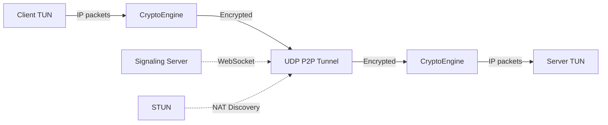

# KeyperVPN

Post-quantum peer-to-peer VPN with hybrid cryptography and terminal UI.

## Architecture



**Crypto Stack:** Kyber-768 (post-quantum KEM) + X25519 (classical ECDH) + ChaCha20-Poly1305 (AEAD)

Both shared secrets are combined via HKDF-SHA256 to derive session keys, providing security against both classical and quantum adversaries.

## Quick Start

### 1. Install Dependencies

```bash
npm install
```

### 2. Start Signaling Server

```bash
npm run signal
```

### 3. Start VPN Server (Terminal 2)

```bash
sudo npm start server
```

### 4. Start VPN Client (Terminal 3)

```bash
sudo npm start client
```

### 5. Test Connectivity

```bash
ping 10.8.0.1  # From client
```

## Configuration

| Setting          | Default                       |
| ---------------- | ----------------------------- |
| Signaling Server | `ws://localhost:8080`         |
| STUN Server      | `stun.l.google.com:19302`     |
| VPN Subnet       | `10.8.0.0/24`                 |
| Server VPN IP    | `10.8.0.1`                    |
| Client VPN IP    | `10.8.0.2`                    |
| TUN MTU          | `1420`                        |
| TUN Device       | `pqvpn0`                      |

Override signaling URL with `SIGNAL_URL` env var:

```bash
SIGNAL_URL=ws://your-server:8080 sudo npm start client
```

## Project Structure

```
keypervpn/
├── src/
│   ├── signaling/
│   │   └── server.ts           # WebSocket signaling server
│   ├── vpn/
│   │   ├── TunDevice.ts        # TUN interface wrapper
│   │   ├── CryptoEngine.ts     # Kyber-768 + X25519 + ChaCha20
│   │   └── VPNTunnel.ts        # Main orchestrator
│   ├── p2p/
│   │   ├── STUNClient.ts       # NAT discovery
│   │   ├── SignalingClient.ts  # WebSocket client
│   │   └── PeerConnection.ts   # UDP hole punching & data relay
│   ├── ui/
│   │   └── App.tsx             # Ink terminal UI
│   ├── types.ts                # Shared interfaces
│   └── index.ts                # Entry point
├── package.json
├── tsconfig.json
└── README.md
```

## Requirements

- **Node.js** 18+
- **Linux** (primary) or macOS
- **Root/sudo** privileges (TUN device requires it)
- Network access for STUN discovery

## Limitations

- No TURN relay — symmetric NAT will fail
- IPv4 only
- Single peer (no mesh)
- No DNS handling (configure manually)
- Linux primary, macOS best-effort

## License

MIT
